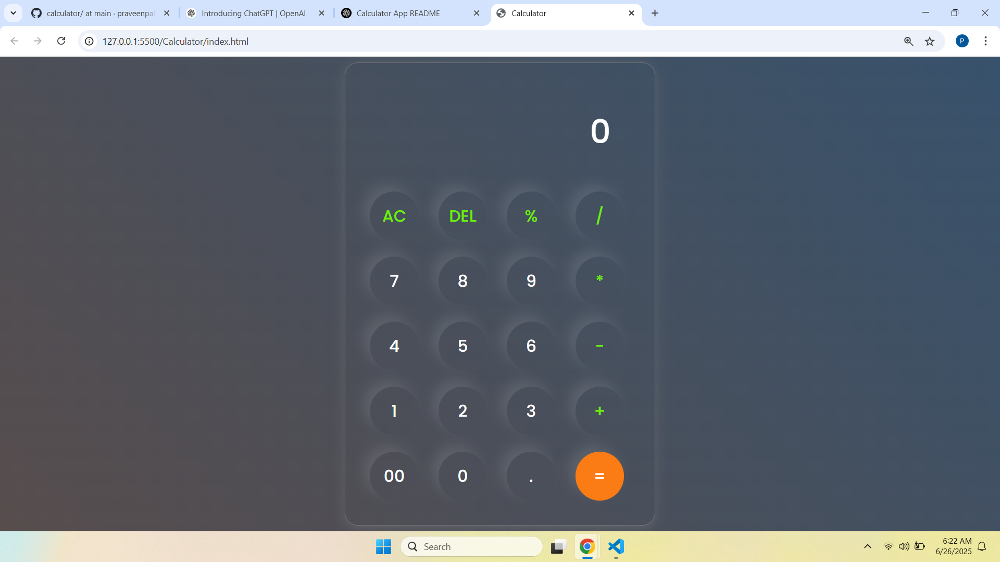

# Calculator App

A simple and stylish calculator built using **HTML**, **CSS**, and **JavaScript**. This calculator performs basic arithmetic operations like addition, subtraction, multiplication, division, and modulo.

## 🚀 Features

- Clean and modern UI
- Responsive layout
- Functional buttons for:
  - Numbers (0-9)
  - Operators (`+`, `-`, `*`, `/`, `%`)
  - Clear (AC)
  - Delete (DEL)
  - Decimal point (.)
  - Equal button (=) to calculate result

## 🖼️ Preview

 

## 💻 Technologies Used

- HTML5
- CSS3
- JavaScript (Vanilla)

## 🛠️ How to Use

1. Clone or download this repository.
2. Open the `index.html` file in any modern browser.
3. Use the calculator by clicking the buttons.

## 📁 File Structure
```bash
calculator-project/
├── index.html # Main HTML file
├── style.css # CSS styling
├── script.js # JavaScript functionality

```
## ⚠️ Note

This calculator uses the built-in `eval()` function to compute expressions. For production-level apps, it is recommended to avoid `eval()` due to security risks.

## 📄 License

This project is open-source and free to use.


